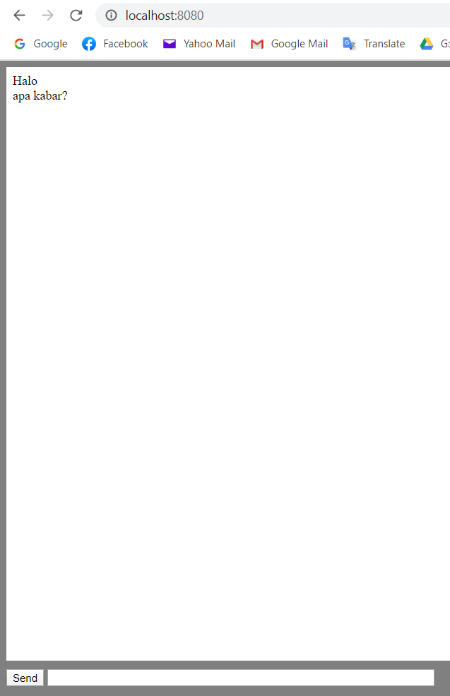

## Getting started
An API that serve real-time messaging. Supported with websocket.

## Installing
Clone this repo under `{GOPATH}/src/github.com/michaelchandrag/warung-pintar`
Set up environment variables at `.env`
run `./run`

## Running the test
```
cd build
go test
```

## Endpoint
Send message
```
URL: [POST] {BASE_URL}/send
Body Request:
{
	"text": "Halo"
}
Body Response:
{
    "data": {
        "id": 1,
        "text": "Halo",
        "created_at": "2020-05-02 19:12:25"
    },
    "message": "Success create message.",
    "success": true
}
```

Read all messages
```
URL: [GET] {BASE_URL}/messages
Body Response:
{
    "data": [
        {
            "id": 1,
            "text": "Halo",
            "created_at": "2020-05-02 19:12:25"
        }
    ],
    "message": "Success fetch messages.",
    "success": true
}
```

Webpage real-time chat (access this in your browser)
```
URL: [GET] {BASE_URL}/
```
